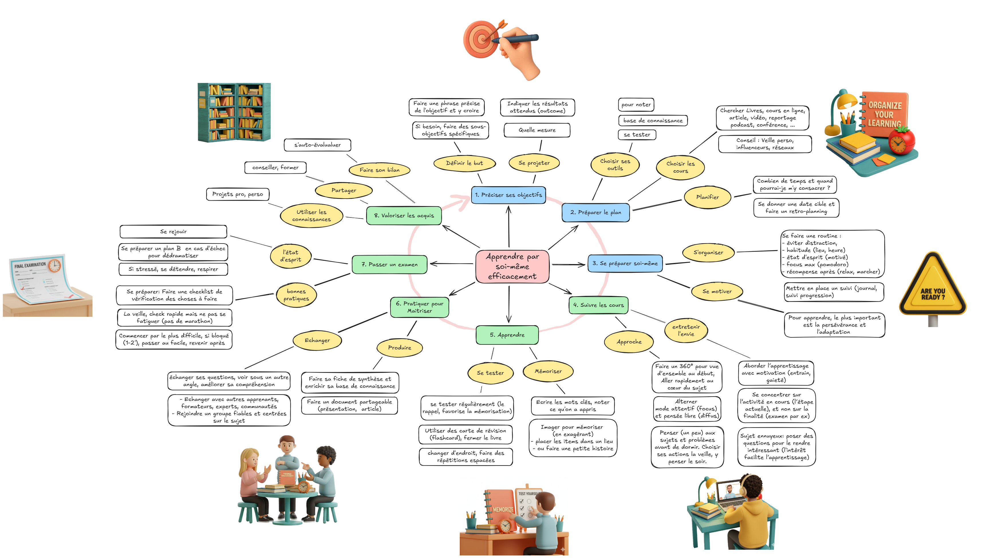

Ce site présente un guide pour apprendre efficacement par soi-même sous forme de carte mentale (mindmap). Il s’agit d’un recueil de bonnes pratiques, basé en bonne partie sur le cours en ligne du Dr Oakley et complété par d’autres, organisé par étape pour guider l’apprentissage personnel. 

## Pourquoi ?
À l’ère de l’IA, apprendre avec agilité est une compétence clé pour suivre l’évolution rapide des pratiques et des métiers. Savoir gérer son propre apprentissage devient alors une compétence du même ordre que savoir s’organiser ou savoir communiquer sur ses missions.

## Quel but ?
L’objectif de ce guide est de proposer un cadre visuel pour servir de repère et partager les bonnes pratiques, en incluant les apports de l’IA pour cela. La vocation de ce guide est d’être évolutif afin de s’adapter et d’être amélioré autant que nécessaire par retour d’expérience. Voici comment contribuer. 

## Comment ?
L’apprentissage est composé de plusieurs **étapes** (en bleu et vert), chacune ayant des **actions** (en jaune), et des **pratiques associées** (par exemple, Apprendre -> Se tester -> utiliser des flashcards). 

L’ordre des étapes donne une direction générale. Rien n'empêche de revenir en arrière ou de faire des sauts entre les étapes pour affiner et améliorer chacune. Par exemple, revenir sur les objectifs pour les ajuster lors de l’apprentissage. 

::: {layout-ncol="2"}
{height="300px" fig-align="center"}

{height="300px" fig-align="center"}
:::

[Commencez](../01-preciser-ses-objectifs/)



