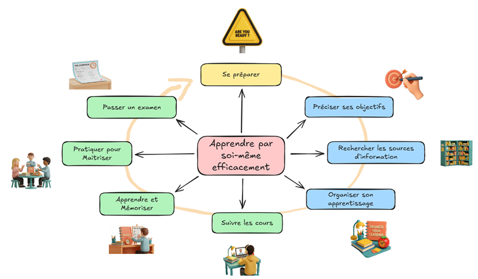

<!-- Image Map Generated by http://www.image-map.net/ -->

<map name="image-map">
    <area target="" alt="Se préparer" title="Se préparer" href="../01-se-preparer/" coords="390,223,351,167,321,139,318,95,347,55,374,20,401,6,445,29,475,64,495,108,483,140,449,176,418,223" shape="poly">
    <area target="_blank" alt="Apprendre" title="" href="./tour-d-horizon-fullsize.png" coords="321,297,485,226" shape="rect">
</map>

  <a href="./tour-d-horizon-fullsize.png" target="_blank" rel="noopener">
    <small>Image en pleine résolution</small>
  </a>

L’apprentissage est composé de huit étapes, une générale (se préparer), trois pour faire son plan d’apprentissage (préciser les objectifs, rechercher les informations, organiser son apprentissage), et quatre pour l’apprentissage lui-même (suivre les cours, apprendre, échanger, passer un examen).

L’ordre des étapes donne une direction générale. Rien n'empêche de revenir en arrière ou de faire des sauts entre les étapes pour affiner et améliorer chacune. Par exemple, on peut revenir sur les objectifs pour les ajuster lors de l’apprentissage. 

Chaque étape est présentée dans les parties suivantes de ce document. Avec une explication sur l’utilisation possible de l’IA.

### Commencez par [Se préparer](../01-se-preparer/)

