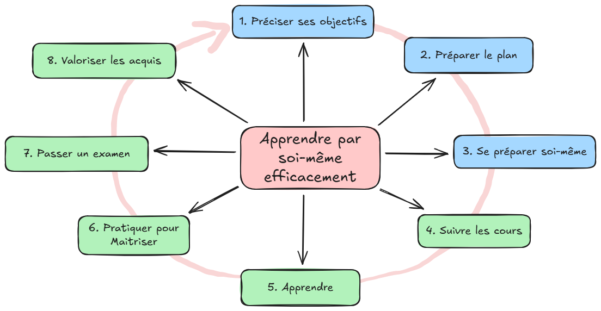
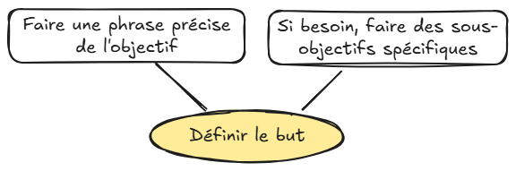
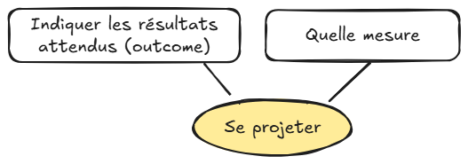

[{fig-align="center" width="400"}](../index.qmd)

## Actions clés

::: {.ovale-main}
[Définir le but](#définir-le-but){.manuscrit}
:::

::: {.ovale-main}
[Se projeter](#se-projeter){.manuscrit}
:::

 
Avant de se lancer dans un apprentissage, l'objectif doit être clair. Pour cela, il s'agit de définir précisemment le **but de l'apprentissage**, et de **se projeter** dans l'avenir pour cibler le résultat attendu.

## Bonnes Pratiques

::: {.ovale-main #définir-le-but}
[Définir le but]{.manuscrit}
:::

{style="display:block; margin:auto;" width="400"}

 

::: {.ovale-main #se-projeter}
[Se projeter]{.manuscrit}
:::

{style="display:block; margin:auto;" width="400"}

