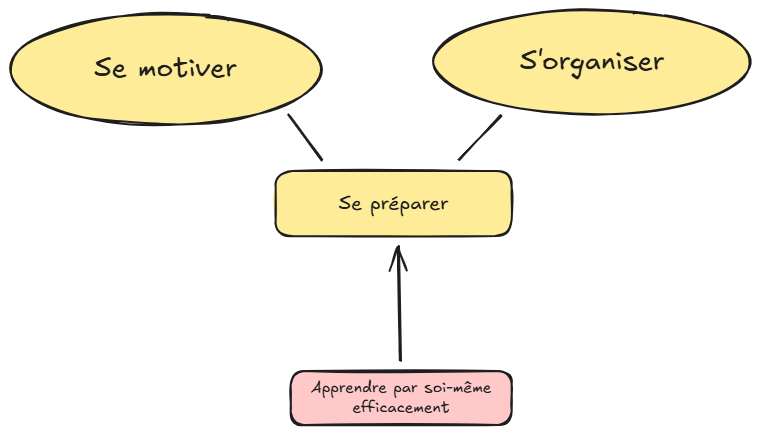
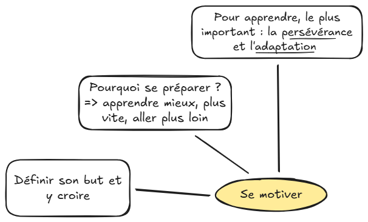
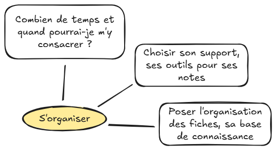

## Points clés

{style="display:block; margin:auto;" width="600"}

Pour se préparer, avant de se lancer dans un apprentissage, deux aspects sont à considérer: sa motivation (l’état d’esprit) et l’organisation pour les apprentissages. 

## Se motiver

{style="display:block; margin:auto;" width="600"}

Le premier aspect, le plus important car c’est le moteur personnel de l'apprentissage”, c'est l’état d’esprit et la motivation. Pour cela, le but de l’apprentissage doit être clair. Le but est la destination et l’apprentissage, le voyage. 

Pour ce dernier, persévérance et adaptation sont les capacités clés pour réussir (s'adapter = être capable de remettre en question ses connaissances passées).

## S'organiser

{style="display:block; margin:auto;" width="600"}

Le deuxième aspect est l’organisation personnelle. Combien de temps peut-on allouer, à quel moment, à quelle fréquence. Également, comment va-t-on gérer la liste de cours, ses notes d’apprentissage et sa base de connaissance. Papier ? numérique ? utilisation d’appli ? Le plus important est d’être à l’aise et que cela soit le plus accessible possible pour que cela ne  représente pas une charge mentale en plus de l’apprentissage lui-même.

## Pret ? Passer à la suite
* ### Préciser ses objectifs

