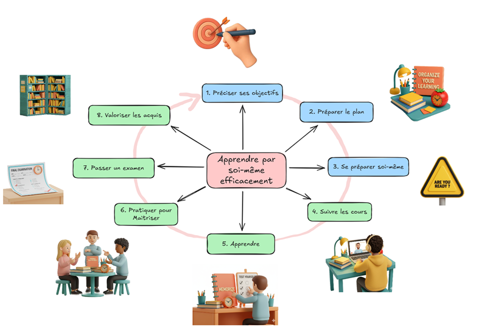

Ce site présente un guide pour apprendre efficacement par soi-même. Il s’agit d’un recueil de bonnes pratiques sous forme de carte mentale (mindmap), organisé par étape pour guider l’apprentissage. 

Cliquer sur les étapes de l'image ci-dessous, ou [en savoir plus](00-presentation/index.qmd) sur le guide. Voir aussi comment [ contribuer](00-presentation/contribs.qmd).

<!-- Image Map Generated by http://www.image-map.net/ -->

<map name="image-map">
    <area target="" alt="Se préparer" title="Se préparer" href="01-preciser-ses-objectifs/" coords="390,223,351,167,321,139,318,95,347,55,374,20,401,6,445,29,475,64,495,108,483,140,449,176,418,223" shape="poly">
    <area target="_blank" alt="Apprendre" title="" href="00-presentation/images/tour-d-horizon-fullsize.png" coords="321,297,485,226" shape="rect">
</map>

