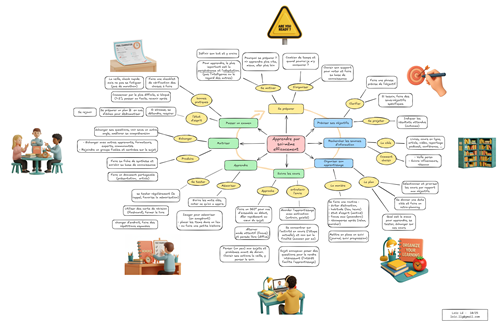

[{style="display:block; margin:auto; max-width:100%;"}](00-tour-d-horizon/index.qmd)

  <a href="./Carte mentale auto apprentissage 2025-10.png" target="_blank" rel="noopener">
    <small>Image en pleine résolution</small>
  </a>

Ce site présente un guide pour apprendre efficacement par soi-même. Il s’agit d’un recueil de bonnes pratiques, basé en bonne partie sur le cours en ligne du Dr Oakley et complété par d’autres, organisé par étape pour guider l’apprentissage personnel. 

À l’ère de l’IA, apprendre avec agilité est une compétence clé pour suivre l’évolution rapide des pratiques et des métiers. Savoir gérer son propre apprentissage devient alors une compétence du même ordre que savoir s’organiser ou savoir communiquer sur ses missions.

L’objectif de ce guide est de donner un cadre visuel pour servir de repère et partager les bonnes pratiques, en incluant les apports de l’IA pour cela. La vocation de ce guide est d’être évolutif afin de s’adapter et d’être amélioré autant que nécessaire par retour d’expérience.

### [Pret ? Commencez par le tour d'horizon pour une vue d'ensemble](00-tour-d-horizon/index.qmd)
